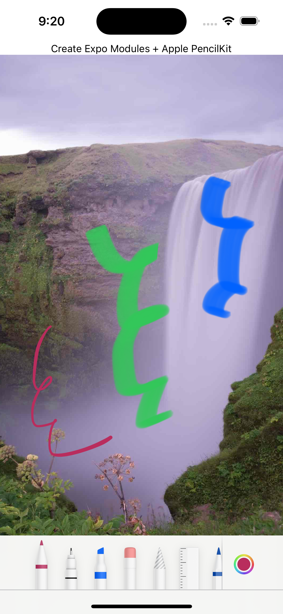

# @noripi10/expo-pencilkit

Apple Pencilkit for Expo(iOS)

# API documentation

- [Pencilkit Document](https://developer.apple.com/documentation/pencilkit)

# Installation in managed Expo projects

For [managed](https://docs.expo.dev/versions/latest/introduction/managed-vs-bare/) Expo projects, please follow the installation instructions in the [API documentation for the latest stable release](#api-documentation). If you follow the link and there is no documentation available then this library is not yet usable within managed projects &mdash; it is likely to be included in an upcoming Expo SDK release.

## Add the package to your npm dependencies

```
yarn install @noripi10/expo-pencilkit
or
npm install @noripi10/expo-pencilkit
```

## How to use

- Prebuild or Development Build

```
  npx expo prebuild -p ios
  or
  eas build -p ios -e development
```

```tsx
import ExpoPencilkit from '@noripi10/expo-pencilkit';
import { SafeAreaView, StyleSheet, Text, View } from 'react-native';

// base64 image data copy here
const imageData = '{}';

export default function App() {
  const clear = async () => {
    clearDrawAsync();
  };

  return (
    <View style={styles.container}>
      <SafeAreaView style={styles.container}>
        <Text style={{ alignSelf: 'center' }}>Create Expo Modules + Apple PencilKit</Text>
        <ExpoPencilkit style={{ flex: 1 }} imageData={imageData} />
      </SafeAreaView>
    </View>
  );
}

const styles = StyleSheet.create({
  container: {
    flex: 1,
    backgroundColor: '#fff',
  },
});
```


